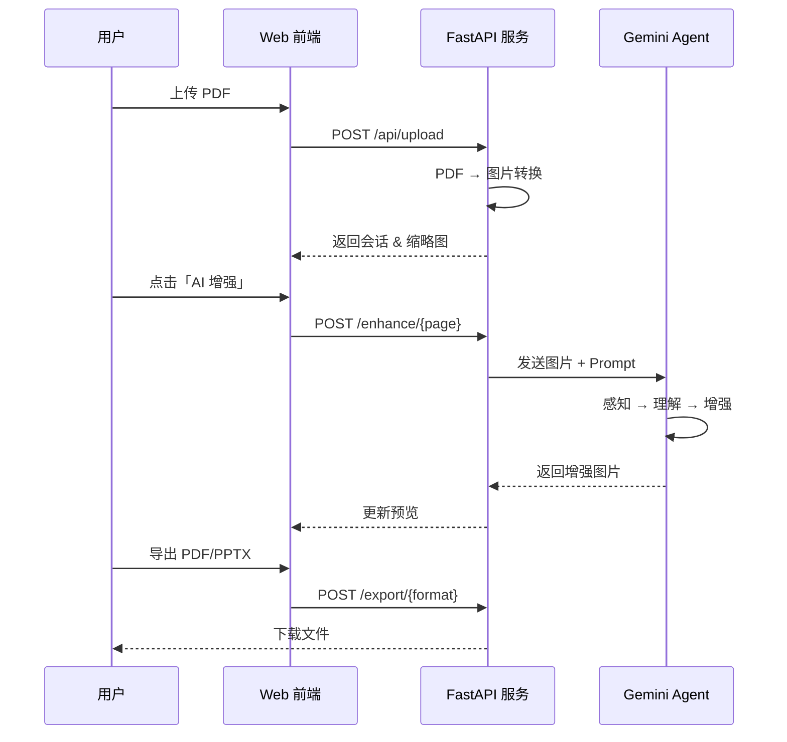

# 🎯 Slide Refiner - AI Agent 驱动的幻灯片增强系统

<p align="center">
  <b>基于 Gemini Pro 多模态 AI Agent 的智能演示文稿优化工具</b>
</p>

---

## ✨ 项目简介

**Slide Refiner** 是一个基于 **AI Agent 架构**的智能幻灯片增强系统。它将传统的 PDF 演示文稿转化为高清晰度、视觉效果优化的专业文档。

### 🤖 Agent 架构设计

本项目采用了 **Autonomous AI Agent（自主式 AI 智能体）** 的设计理念：

```
┌─────────────────────────────────────────────────────────────┐
│                    Slide Refiner Agent                       │
├─────────────────────────────────────────────────────────────┤
│  📥 感知层 (Perception)                                       │
│  ├── PDF 解析：提取每页幻灯片为高质量图像                        │
│  ├── 宽高比检测：自动识别 16:9、4:3 等标准比例                   │
│  └── 水印区域定位：智能识别右下角水印位置                        │
├─────────────────────────────────────────────────────────────┤
│  🧠 决策层 (Reasoning)                                        │
│  ├── Gemini Pro Vision：多模态理解幻灯片内容与结构              │
│  ├── 质量评估：分析模糊度、噪点、压缩伪影等问题                   │
│  └── 任务规划：确定增强策略与优先级                             │
├─────────────────────────────────────────────────────────────┤
│  ⚡ 执行层 (Action)                                           │
│  ├── 图像增强：4K 超高清晰度提升                               │
│  ├── 文字锐化：确保文本清晰可读                                 │
│  ├── 色彩优化：提升色彩鲜艳度同时保持原始配色                    │
│  └── 水印修复：智能填充被遮挡区域（可选）                        │
└─────────────────────────────────────────────────────────────┘
```

### 🎯 为什么是 Agent？

传统图像处理工具使用固定规则，而 Slide Refiner 采用 **Agent 模式**：

| 传统方式 | Agent 方式 |
|---------|-----------|
| 固定滤镜参数 | 根据内容自适应调整 |
| 统一处理流程 | 理解上下文后智能决策 |
| 人工指定增强区域 | 自主识别问题区域 |
| 单一输出 | 可根据自定义 Prompt 灵活调整 |

---

## 🛠️ 核心功能

### 📤 智能上传与解析

- 支持 PDF 格式演示文稿（最大 100MB）
- 自动提取并预览所有幻灯片
- 高精度图像转换 (200 DPI)

### 🎨 AI 驱动增强

- **自动模式**：一键批量增强所有页面
- **交互模式**：为单页提供自定义 Prompt 指令
- **水印移除**：智能识别并填充 NotebookLM 等平台水印
- **进度条显示**：批量处理时实时显示进度

### 🖼️ 模板背景替换 ✨

- 上传自定义模板背景图片
- AI 自动提取幻灯片内容并融合到模板上
- 智能调整颜色和排版以匹配模板风格
- 支持批量应用到所有页面

### ➕ 页面扩展 ✨

- 指定新增页数（1-10 页）
- 可选填写内容主题方向
- AI 分析现有幻灯片风格，生成视觉一致的新页面
- 新页面自动添加到演示文稿末尾

### 📦 灵活导出

- **PDF 格式**：保持原始阅读体验
- **PPTX 格式**：可继续在 PowerPoint 中编辑

---

## 🚀 快速开始

### 环境要求

- Python 3.10+
- poppler（用于 PDF 处理）

### 安装步骤

```bash
# 1. 克隆项目
git clone https://github.com/your-repo/slide_refiner.git
cd slide_refiner

# 2. 创建虚拟环境
python -m venv .venv
source .venv/bin/activate  # macOS/Linux
# .venv\Scripts\activate   # Windows

# 3. 安装依赖
pip install -r requirements.txt

# 4. 安装 poppler
brew install poppler       # macOS
# apt-get install poppler-utils  # Ubuntu
```

### 配置 API Key

```bash
# 在 webapp/.env 文件中配置
GOOGLE_API_KEY=your_gemini_api_key_here
```

### 启动服务

```bash
cd webapp
python main.py

# 访问 http://localhost:9998
```

---

## 📖 使用方式

### 方式一：Web 应用（推荐）

1. 打开浏览器访问 `http://localhost:9998`
2. 拖拽或点击上传 PDF 文件
3. 在左侧缩略图中选择页面
4. 点击「AI 增强」按钮处理当前页
5. 可选：输入自定义指令微调效果
6. 处理完成后导出 PDF 或 PPTX

### 方式二：命令行工具

```bash
# 基础用法
python slide_refiner.py input.pdf output.pdf

# 指定分辨率
python slide_refiner.py input.pdf output.pdf 4K

# 移除水印
python slide_refiner.py input.pdf output.pdf 4K --remove-watermark
```

---

## 🧩 技术架构

```
slide_refiner/
├── slide_refiner.py     # 核心 Agent 逻辑（命令行版本）
├── webapp/
│   ├── main.py          # FastAPI 后端 + Agent 服务
│   ├── static/
│   │   ├── index.html   # 前端界面
│   │   ├── app.js       # 交互逻辑
│   │   └── style.css    # 样式
│   └── sessions/        # 会话数据存储
└── requirements.txt
```

### 技术栈

| 层级 | 技术 |
|-----|------|
| **AI Agent** | Google Gemini 3 Pro (gemini-3-pro-image-preview) |
| **后端框架** | FastAPI + Uvicorn |
| **PDF 处理** | pdf2image + Pillow + img2pdf |
| **PPTX 导出** | python-pptx |
| **前端** | 原生 HTML/CSS/JS |

---

## 🔄 Agent 工作流程



---

## 🧠 Agent 设计理念

### 1. 多模态感知

Agent 接收图像输入，理解幻灯片中的：

- 文本内容与字体
- 图表与可视化元素
- 布局与配色方案

### 2. 目标导向推理

每次增强任务，Agent 都在追求：

- 保持内容完整性（不增删改变任何信息）
- 最大化视觉清晰度
- 优化色彩表现

### 3. 自主任务执行

批量处理时，Agent 自动：

- 遍历所有待处理页面
- 为每页独立进行增强决策
- 处理失败时自动重试（最多 3 次）
- 记录处理进度与状态

### 4. 人机协作

支持人类介入调整：

- 自定义 Prompt 覆盖默认行为
- 重置单页重新处理
- 选择性跳过已完成页面

---

## 📝 License

MIT License

---

<p align="center">
  <b>🚀 Powered by Gemini AI Agent</b><br>
  <i>让每一页幻灯片都呈现最佳状态</i>
</p>
